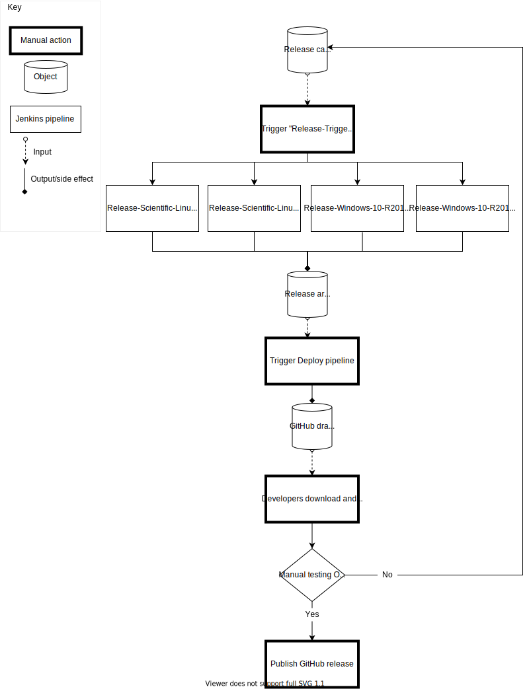

# Deploying releases to GitHub

## ci-release-deploy Repository

A repository
[ci-release-deploy](https://github.com/pace-neutrons/ci-release-deploy)
has been created to hold the code that implements the deployment pipeline.
The additional repository ensures that
code is not duplicated between Herbert and Horace,
and to provide fast checkout times for the deploy pipelines.

## Release Pipelines

The release pipelines in ANVIL's Jenkins server should be used to create release
candidates.
These pipelines have a `Release-` prefix.
The pipelines differ from the master builds in that they ensure the
`-DHORACE_RELEASE_TYPE=release` is passed to CMake.
This flag ensures the package is created with the correct version semantics,
i.e. `3.4.1` rather than `3.4.1.<git-revision>`.
The release pipelines also output a `.sha` file that contains the Git SHA of
the built revision.

The release pipelines in Horace have a second parameter `HERBERT_BRANCH_NAME`,
which must be specified. A Herbert branch/tag/revision matching this name will
be used in testing and bundled in the generated release.

## Deploy Pipelines

The deploy pipelines created on ANVIL's Jenkins server should be used to deploy
release candidates to GitHub.
Horace and Herbert each have their own deploy pipeline named `Deploy`.
When triggered, this pipeline takes the following parameters:

- `tag_sha`: The SHA of the Git revision on which to create the release tag
  (usually the head of the release branch).

- `version_number`: The full version number of the release e.g. `3.4.1`

- `release_job_ids`: The IDs of jobs that contain target release artifacts.
This is a multiline string parameter whose input should have the form:

  ```txt
  <pipeline name> <build number>
  <pipeline name> <build number>
                ...
  <pipeline name> <build number>
  ```

  where, for example,
  `<pipeline name> <build number>` = `Release-Windows-10-2019b 12`.

  This gives the pipeline the information required to copy release artifacts
  from those builds.

- `release_body`: The description of the release to show on GitHub.
This will usually be release notes.
This should be formatted as Markdown.

- `is_draft`: Boolean switch to mark the release as a draft.

- `is_prerelease`: Boolean switch to mark the release as a pre-release.

- `repo_name`: The name of the repository to create the release on,
i.e. `Herbert` or `Horace`.

The pipelines perform the following steps:

1) Copy all `<repo_name>-*.zip`/`<repo_name>-*.tar.gz`,
and `*.sha` artifacts from the inputted `Release-` pipeline jobs.

2) Validate that the `version_number` parameter matches the version number in
the file names of the release artifacts.

3) Validate that the `tag_sha` parameter matches the SHAs in the `*.sha`
artifacts retrieved from the `Release-` pipeline jobs.

4) Send POST request to GitHub to create a release.

5) Upload the release artifacts to the release created in step 4.

The Deploy pipelines use a token linked to the `pace-builder` account to
authenticate access to GitHub's API.

## Steps to create a new (non-patch) release

1. Create a branch for the upcoming release named `rel_<major>_<minor>`
e.g. `rel_3_4`.

2. Trigger the release pipelines using the `Release-Trigger` pipeline.
Set the `BRANCH_NAME` parameter to the name of the release branch.
Set `HERBERT_BRANCH_NAME` to the relevant Herbert branch/revision.

3. When the pipelines have run and created the release artifacts,
pass the name and numbers of the release's build jobs to the `Deploy` pipeline.
You must also specify the Git SHA revision to tag on GitHub,
this should be the full SHA of the Git revision built in the release pipelines
(usually the head of the release branch).
The Git SHA is used to validate that all the packages being pushed to GitHub
are the same revision and that that revision matches the revision to be
tagged.
Ensure the parameter `is_draft` is checked/set to true.
This will create a draft release on GitHub and upload the build artifacts to it.

4. Open a ticket titled `Release v<major>.<minor>` on GitHub.
In this ticket, provide a link to the draft release
(this link is not accessible to GitHub users who do not have write access to
the repository).
From here developers can download the release candidates.

5. Developers should perform manual testing of the release candidates
on all target platforms.
They should download and install release candidates from the draft release.
An issue must be created for any bug or problem found with the release candidate.
Any such issues should be labelled with the name of the release.
Any pull requests must be opened to merge into the release branch created in 1.

6. After testing has been performed and bug fixes have been merged,
repeat steps 2-3 with the updated release branch.
Again, ensure the release is a draft.
You can have more than one equivalent GitHub draft release at once.
So, once the new release candidates have been created,
a new draft release can be pushed to GitHub and the hold draft deleted.
You can delete the draft from the "Releases" page on GitHub.

7. Smoke test the new release candidates in the draft release.
A set of smoke tests is given in the [smoke_testing SMG](./13_smoke_testing.md).

8. After smoke tests are complete and developers are happy with the package,
the draft release can be manually published from within the GitHub releases page.
This creates the tag in Git and makes the release artifacts public.

### Release process flowchart


